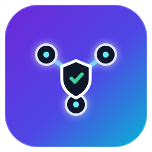
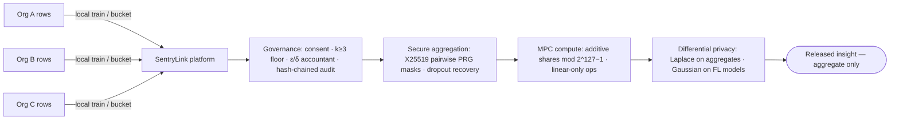

<p align="center">
  
</p>

<h1 align="center">SentryLink</h1>

<p align="center">
  <strong>Privacy-preserving cross-organization intelligence layer.</strong><br/>
  Pool insights across companies without ever sharing raw data.
</p>

<p align="center">
  
  
  
  
  
</p>

---

### The problem it solves

Every industry sits on fragmented data goldmines — retailers see regional demand,
plants see defect signals, hospitals see treatment responses — but nobody can pool
it. Raw data is a competitive asset and a regulatory liability.

**SentryLink breaks the deadlock:** organizations train and aggregate *together*,
yet each party only ever sees **noised, aggregated results**. Raw rows never leave
the building.

| Vertical        | Collective insight                          |
|-----------------|---------------------------------------------|
| Retailers       | Emerging demand patterns across regions     |
| Manufacturers   | Quality / defect signals across plants      |
| Hospitals       | Treatment-response clusters across sites    |

---

### How it works



The privacy stack, in one breath:

1. **Federated learning** — orgs train a shared logistic model locally; only
   clipped **weight deltas** leave the org.
2. **Secure aggregation** (Bonawitz-style) — deltas are quantized to int64 and
   masked with pairwise PRG streams from an **X25519 ECDH + HKDF** seed. Masks
   cancel in the sum: the server learns *only the aggregate*. Survivors reveal
   seeds for dropped peers so the sum stays well-defined.
3. **Secure MPC** — histograms, variance, and correlation run as **additive
   secret shares** across two non-colluding compute nodes. By design no query
   needs cross-org products: each org reduces its own rows to sufficient
   statistics locally, so the protocol stays linear-only.
4. **Differential privacy** — every released number is perturbed: **Laplace**
   (pure ε-DP) for aggregates, **Gaussian** ((ε, δ)-DP) for federated updates,
   all tracked by a privacy accountant.
5. **Governance** — per-org consent allow-lists, a **k ≥ 3 cohort floor**
   (k ≥ 4 for healthcare), per-org contribution caps, and an append-only
   **hash-chained audit log**.

<details>
<summary><strong>Threat model</strong></summary>

| Adversary                        | Protection                                              |
|----------------------------------|---------------------------------------------------------|
| Curious server / coordinator     | Secure aggregation (sums only) + DP on outputs          |
| One curious compute node         | Additive secret shares (view is uniform random)         |
| Both compute nodes colluding     | Out of scope for the 2-node demo → add a 3rd node       |
| Outside observer on transport    | Deployment concern — run behind TLS                     |
| Malicious participant poisoning  | L2 clipping + DP noise (partially mitigated)            |

</details>

---

### Quickstart

```bash
python -m venv .venv && source .venv/bin/activate   # Windows: .venv\Scripts\activate
pip install -r requirements.txt

# end-to-end demo across all three verticals
python -m sentrylink.demo

# run the test suite
python -m pytest -q

# start the API
uvicorn sentrylink.api.app:app --reload
# → interactive docs at http://127.0.0.1:8000/docs
```

---

### API at a glance

| Method | Endpoint               | What it does                              |
|--------|------------------------|-------------------------------------------|
| `POST` | `/orgs`                | Onboard an organization (returns api_key) |
| `POST` | `/consent`             | Set metric allow-list (API-key auth)      |
| `POST` | `/queries/histogram`   | MPC + DP bucket counts                    |
| `POST` | `/queries/variance`    | MPC + DP dispersion                       |
| `POST` | `/queries/correlation` | MPC + DP association                      |
| `POST` | `/federated/round`     | Secure-aggregated FL round (+DP)          |
| `GET`  | `/federated/model`     | Global model for a cohort                 |
| `GET`  | `/audit`               | Verify the hash-chained audit log         |
| `GET`  | `/budgets`             | ε/δ spent vs. remaining (incl. RDP spend) |
| `GET`  | `/health`              | Liveness + backend (`memory`/`sqlite`)    |
| `GET`  | `/ready`               | Readiness: store reachable + chain intact |

### Persistent storage

The platform runs on two backends behind one `StateStore` interface:

- **In-memory** (default) — zero I/O, used by tests.
- **SQLite** (production-like) — SQLAlchemy 2.0, WAL concurrency, one
  transaction per mutation, versioned migrations, deterministic recovery.

```bash
# production-like execution: state survives process restarts
export SENTRYLINK_DB=/var/lib/sentrylink/state.db   # or sqlite:////path/to.db
uvicorn sentrylink.api.app:app
curl localhost:8000/ready   # {"ready": true, "storage": "sqlite", ...}
```

```python
from sentrylink.platform import SentryLinkPlatform
from sentrylink.storage import SQLiteStateStore

p = SentryLinkPlatform(store=SQLiteStateStore("/var/lib/sentrylink/state.db"))
# joins, consent, queries, FL rounds persist transactionally ...
p2 = SentryLinkPlatform(store=SQLiteStateStore("/var/lib/sentrylink/state.db"))
assert p2.audit.verify_chain()  # ... and replay deterministically here
```

Persisted: org identities, salted API-key hashes (**never** plaintext keys),
consent allow-lists + caps, privacy budgets (spent, events, RDP totals),
federated models + round history, audit entries. Never persisted: raw rows,
features, private keys, unmasked updates. See `sentrylink/storage/` and
`tests/test_storage.py`, `tests/test_recovery.py`.

---

### Repository layout

```
sentrylink/
  config.py               # field prime, quantization, clip bounds, floors
  platform.py             # policy + MPC + DP + audit orchestration (the entry point)
  crypto/
    prg.py                # HMAC-SHA256 PRG for pairwise masks
    secret_sharing.py     # additive shares mod 2^127-1
    secure_aggregation.py # X25519 pairwise masking + dropout recovery
    differential_privacy.py # Gaussian/Laplace mechanisms, budgets, accountant
  mpc/
    stats.py              # compute nodes, additive-only histogram/var/corr
  federated/
    model.py              # logistic regression + sufficient stats
    client.py             # local SGD → delta
    server.py             # rounds with secure agg + central DP
  governance/
    registry.py           # org identities
    policy.py             # consent, k-floor, contribution caps
    audit.py              # hash-chained log
  api/
    app.py                # FastAPI endpoints (thin wrapper over platform.py)
    schemas.py
  usecases/
    synthetic.py          # retail / manufacturing / healthcare cohorts
  demo.py                 # three-vertical walkthrough
tests/                    # unit + integration + API tests
```

---

### Design notes worth knowing

- **Quantized secure aggregation** — masks are int64 in `[−2^40, 2^40]`, so float
  non-associativity never leaks and sums stay well inside int64 range.
- **DP sensitivity** — federated aggregates use `2C·|roster|` after L2 clipping
  (`C = 1.0`); histogram releases use the per-org contribution cap
  (`MAX_ORG_CONTRIB`) as the bound.
- **Own-data products are local** — orgs may square / `xy` their own rows before
  sharing; only *cross-org* combination happens on shares.
- **Healthcare policy is stricter** — higher cohort floor (k ≥ 4), narrower
  metric allow-list (no variance), and a lower per-query ε cap, showcasing
  policy differentiation.

### Production hardening roadmap

- ✅ Persistent storage + migrations + crash recovery — shipped
  (`sentrylink/storage/`, SQLite + SQLAlchemy, RLock-serialized mutations)

- TLS + mutual auth for the API; HSM/KMS-backed keys
- Malicious-secure triple generation (IKNP OT) or threshold Paillier/CKKS
  instead of the demo dealer
- Third compute node / robust secret sharing
- Advanced composition via RDP moments accountant — implemented
  (`crypto/differential_privacy.py`); limits enforce the tighter RDP bound
  whenever all events carry RDP costs, basic composition otherwise
- Model-poisoning defenses (Krum / trimmed mean) alongside clipping
- Persistent storage + horizontal API scale-out

---

<p align="center">
  Built for regulated, competitive verticals — retail, manufacturing, healthcare, finance —<br/>
  where the data can't move, but the <strong>insight</strong> must.
</p>
