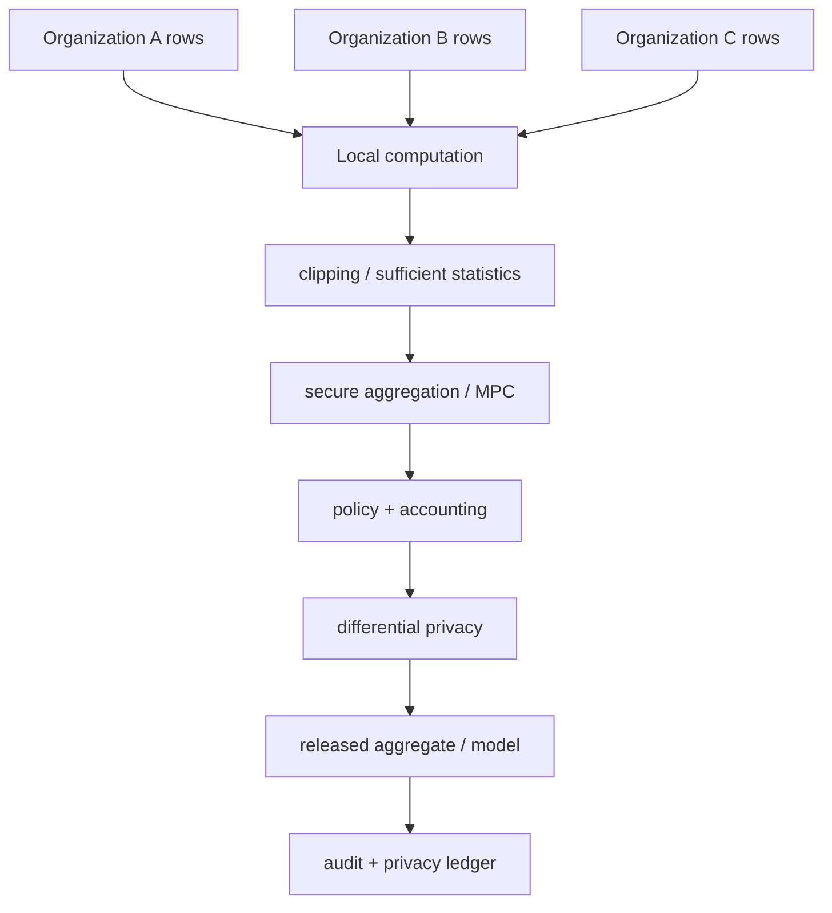
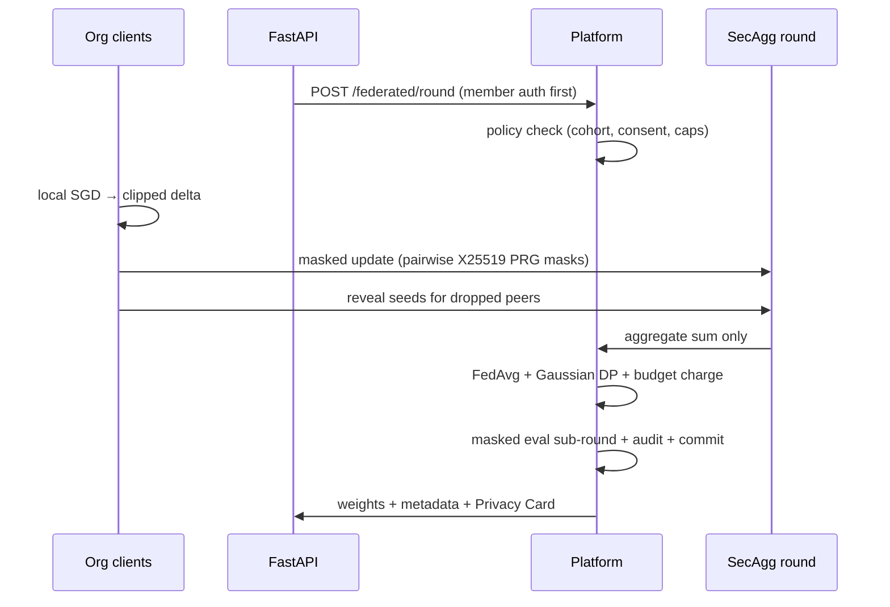
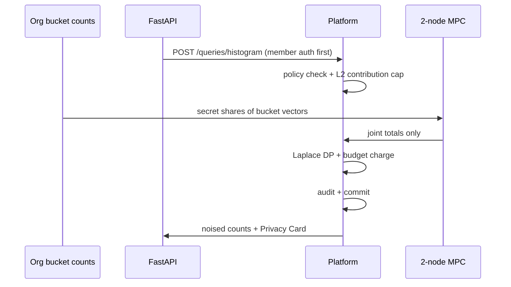

<p align="center">
  
</p>

<h1 align="center">SentryLink</h1>

<p align="center">
  <strong>Privacy-Preserving Cross-Organization Intelligence</strong><br/>
  Federated learning + secure aggregation + MPC + differential privacy,
  governed and auditable — without raw data ever leaving its organization.
</p>

<p align="center">
  
  
  
  
  
</p>

---

## Why SentryLink?

Every industry sits on fragmented data: retailers see regional demand, plants
see defect signals, hospitals see treatment responses — but nobody can pool
it. Raw data is a competitive asset and a regulatory liability.

SentryLink breaks the deadlock with an honest, small core:

```text
SentryLink
     ├── Intelligence: federated learning, histograms, variance, correlation
     ├── Privacy: secure aggregation, MPC, differential privacy, RDP accounting
     ├── Governance: consent, cohort policies, vertical policies, budgets
     ├── Trust: audit chain, privacy ledger, privacy cards, restart replay
     └── Verification: red team, simulation, benchmarks, 143 tests
```

Measurable claims only: every guarantee below names the mechanism, the
parameter, and the test that pins it.

## Architecture



```text
                    ┌─────────────────────────┐
                    │       FastAPI API        │
                    │   api/app.py (thin)      │
                    └────────────┬────────────┘
                                 ▼
                    ┌─────────────────────────┐
                    │    SentryLinkPlatform   │
                    │ platform.py             │
                    └────────────┬────────────┘
                                 ▼
                      storage/codec.py (sole boundary)
                                 ▼
                    ┌──────────┴─────────┐
                    ▼                    ▼
              InMemoryStore        SQLiteStore
```

Layering rule: domain objects → `storage/codec.py` → plain dicts/bytes →
`store.py` → SQL. Nothing outside `codec.py` touches persisted forms.

### Federated round (sequence)



### Histogram query (sequence)



## Threat Model

| Adversary | Protection |
|---|---|
| Curious server / coordinator | Pairwise-masked aggregation (sums only) + DP on every release; per-client eval tallies masked |
| One curious compute node | Additive secret shares (single-node view is uniform random) |
| Curious observer of storage | Salted hashes only (pbkdf2-sha256, per-org random salt); no rows, keys, or unmasked updates persisted |
| Outside observer on transport | **Deployment responsibility — run behind TLS.** Not a SentryLink feature |
| Malicious participant poisoning | L2 clipping + DP noise only (partial mitigation) |

Explicitly **out of scope**: colluding MPC nodes in the 2-node design;
Byzantine robustness is **not** claimed.

## Privacy Model

- **Laplace (pure ε-DP)**, scale = sensitivity/ε, for histograms, variance,
  correlation (charged with δ = 0).
- **Gaussian ((ε,δ)-DP)**, analytic calibration
  σ = sens·√(2·ln(1.25/δ))/ε, for federated model updates.
- Sensitivities: FL mean `2C/k` (C = 1.0, k = survivors) · histogram
  `MAX_ORG_CONTRIB = 100.0` (L2-projected per org, inward rounding) ·
  variance `1.0` · correlation `≤ 2` (output clipped to `[-1, 1]`).

## Security Model

- X25519 ECDH + HKDF-SHA256 pairwise seeds, HMAC-SHA256 PRG masks in
  ±2⁴⁰ (int64-safe); fixed-point quantization at 1e6 with L2 clipping.
- Trust boundary is structural: `SecAggClient` owns private keys,
  `SecAggServer` provably holds none (graph-walk test + shape tripwire).
- API keys: pbkdf2-sha256 with per-org random salt, shown once, verified in
  constant time, surviving restarts via hash.
- Every budget-spending endpoint requires a cohort-member credential,
  verified **before** any budget is spent. Structured errors carry stable
  reason codes (`COHORT_TOO_SMALL`, `BUDGET_EXHAUSTED`, …) plus request IDs.

## Supported Verticals

| Vertical | Cohort floor | Metrics | ε cap |
|---|---|---|---|
| Retail | k ≥ 3 | histogram, variance, correlation, federated round | 25.0 |
| Manufacturing | k ≥ 3 | histogram, variance, correlation, federated round | 25.0 |
| Healthcare | k ≥ 4 | histogram, correlation, federated round (**no variance**) | 10.0 |

Verticals are policy objects (`sentrylink/verticals.py`), not branches:
`RetailPolicy`, `ManufacturingPolicy`, `HealthcarePolicy` consumed by core
governance. Consent edits replace only the allow-list — caps and floors
survive. Synthetic datasets document every feature
(`RetailDataset.FEATURES`, …); healthcare data is explicitly non-identifying.

## Quick Start

```bash
python -m venv .venv && source .venv/bin/activate   # Windows: .venv\Scripts\activate
pip install -r requirements.txt

python -m pytest -q            # 143 tests, no external services
python -m sentrylink.demo      # 20-step narrative across all verticals
python -m sentrylink.redteam   # 17 adversarial self-checks
python -m sentrylink.simulate --vertical manufacturing [--json]
python -m sentrylink.bench [--json]
python -m sentrylink.report [--json]

uvicorn sentrylink.api.app:app --reload   # docs at /docs
SENTRYLINK_DB=./state.db uvicorn sentrylink.api.app:app   # persistent mode
```

Configuration (`sentrylink/settings.py`, validated at startup):
`SENTRYLINK_DB`, `SENTRYLINK_LOG_LEVEL`, `SENTRYLINK_RATE_LIMIT`
(`"<n>/<second|minute|hour>"`, default `300/minute`), `SENTRYLINK_ENV`.

## API

| Method | Endpoint | Auth | Purpose |
|---|---|---|---|
| `POST` | `/orgs` | open | Onboard (api_key returned once) |
| `POST` | `/consent` | key | Allow-list (caps/floors preserved) |
| `POST` | `/queries/histogram` | member | MPC + Laplace counts + Privacy Card |
| `POST` | `/queries/variance` | member | MPC + Laplace dispersion + card |
| `POST` | `/queries/correlation` | member | MPC + Laplace association + card |
| `POST` | `/queries/preview` | member | Cost/admission projection, spends nothing |
| `POST` | `/federated/round` | member | Masked FL round + DP + metadata + card |
| `GET` | `/federated/model` | member headers | Weights + release metadata + card |
| `GET` | `/orgs`, `/audit`, `/audit/timeline`, `/budgets` | open | Transparency (sanitized) |
| `GET` | `/health`, `/ready`, `/transparency` | open | Liveness, readiness, observatory view |

Credentials: `org_id` + `api_key` in POST bodies, `X-Org-Id` / `X-API-Key`
headers for GETs (keys never travel in URLs). Every response carries
`X-Request-Id` (accepted inbound when well-formed, else generated).

HTTP semantics: `400` invalid data · `401` bad credential · `403` non-member /
governance / budget · `404` no model yet · `409` concurrent-write conflict
(stale writer lost a race; reconverged client-side, safe to retry) ·
`422` malformed body · `429` rate limited (never confused with budget
exhaustion) · `500` internal · `503` not ready. Error bodies are structured:
`{"error": {"code": "BUDGET_EXHAUSTED", "message": "…", "request_id": "…"}}`.

## Federated Learning

L2-regularized logistic regression; orgs train locally and return weight
deltas; server runs FedAvg. Dimension is inferred from the first client;
released weights are `dim + 1` (bias + features). Inputs are validated
(finite, binary labels, non-empty, lr > 0, epochs ≥ 1, no duplicate orgs).
Dropout: full client dict + `drop=[…]`; survivors reveal seeds; `N-1` and
multi-dropout recovery tested exact. Round metadata
(`participants_total/active/dropped`, `recovery_used`) is transparent.

## Secure Aggregation

Bonawitz-style pairwise masking over fixed-point int64 vectors:
float → L2 clip → quantize → mask → aggregate → unmask → dequantize.
Eval tallies pool through a masked dim-3 sub-round with `clip_bound=None`
(counts must never be rescaled) and stay exact pre-release. Tests pin
cancellation (roster sizes 2–6), dropout recovery, single-survivor exactness,
quantization error (< 1e-6), and the no-private-key server invariant
(objects, bytes, seeds, reference paths, serialization, shape tripwire).

## MPC

Deliberately linear-only: orgs pre-reduce rows to sufficient statistics
locally (own-data products never cross the boundary); compute nodes only add
shares mod 2¹²⁷−1. No triple machinery — reintroducing products requires a
no-leak protocol redesign, not an optimization.

## Differential Privacy

Mechanisms and sensitivities above; every release path covered. Noise is
unseeded per call (tests assert ranges and `raw_value`, never exact noise).

## RDP Accounting

Per-event Renyi costs summed over orders
`[1.5 … 64]`, converted via `min_α(RDP(α) + ln(1/δ)/(α−1))`. A charge is
allowed when **either** the basic sum or the RDP bound fits — each is
independently valid (RDP wins on many-Gaussian workloads, basic on
few-Laplace ones). The applied FL noise is read from `RoundResult.dp_sigma`.
Every `accountant.charge` site must pass an `rdp=` cost or enforcement
silently falls back to basic composition.

## Governance

Registry (hashed credentials), consent (allow-list-only edits), policy engine
with stable reason codes (`BAD_CREDENTIAL`, `ORG_NOT_MEMBER`,
`CONSENT_REQUIRED`, `SECTOR_MISMATCH`, `DOMAIN_MISMATCH`, `COHORT_TOO_SMALL`,
`HEALTHCARE_COHORT_TOO_SMALL`, `QUERY_NOT_ALLOWED`, `EPSILON_TOO_HIGH`,
`HEALTHCARE_EPSILON_TOO_HIGH`, `BUDGET_EXHAUSTED`, `MODEL_DIMENSION_MISMATCH`,
`DUPLICATE_ROSTER`, `INVALID_DATA`, `RATE_LIMITED`). Decisions carry codes
plus policy snapshots; `raise_if_denied` raises coded subclasses of the
original builtins (fully backward compatible).

## Privacy Budget

Every spend is an immutable `PrivacyLedgerEntry`: scope, query/model type,
mechanism, ε/δ, RDP orders, sensitivity, cohort size, clip bound, timestamp,
request ID, budget before/after. Served via `/budgets`. `POST
/queries/preview` projects cost and admission with zero side effects (no
spend, no mutation, no audit charge). Every release ships a generated
Privacy Card (mechanism, ε/δ, sensitivity, cohort size — never identities).

## Auditability

Append-only hash-chained log (`org.join`, `consent.update`,
`query.*`, `federated.round`) with request IDs; `verify_chain()` detects
modification, reordering, forged predecessors, malformed entries (tail
truncation is caught via head/count checkpoints, exposed by `/audit` and
`/transparency`). Developer stage timeline at `/audit/timeline`.

## Persistence

SQLite (WAL, 30 s busy timeout) + SQLAlchemy 2.0 behind a `StateStore`
interface (`InMemoryStateStore` for tests). Seven tables, versioned
migrations (`schema_meta`; v2 added per-org key salts + round deltas),
one transaction per mutation, RLock-serialized callers, reconvergence on
commit failure, deterministic restart replay (orgs, budgets, models, history,
credentials). Persisted: identities, key hashes, policies, budgets, models,
audit. Never persisted: raw rows, features, private keys, unmasked updates,
plaintext API keys (column-whitelisted + byte-scanned in tests).

## Demo

`python -m sentrylink.demo` runs a 20-step narrative (register → credentials
→ governance → consent → data → histogram + card → variance/correlation →
training → dropout → aggregate → DP → ledger → audit → verify → SQLite
restart → re-authenticate → continuity → ledger → card → budget) plus compact
manufacturing/healthcare passes, ending with a guarantees panel
(raw data / keys / unmasked updates left: NO; DP applied: YES; chain: YES).

## Red-Team Mode

`python -m sentrylink.redteam` — 17 checks (bad credentials, non-members,
cross-domain, small cohorts, healthcare violations, duplicates, NaN/inf,
dim mismatch, exhaustion, DB failure, key retention, raw persistence, audit
tampering, dropout inconsistency, honest-round sanity). Not an offensive
tool; a self-test proving rejections. All must print `[PASS]`.

## Benchmarks

`python -m sentrylink.bench` times each operation on tiny fixtures
(illustrative dev-machine seconds, not claims):

| operation | s |
|---|---|
| registration | 0.34 |
| histogram | 0.45 |
| variance | 0.42 |
| correlation | 0.49 |
| FL round | 0.46 |
| secagg mask+finalize | 0.006 |
| MPC reconstruct | 0.005 |
| SQLite transaction | 0.11 |
| audit append | 0.0003 |

`python -m sentrylink.simulate --vertical <name> [--json]` reports cohort,
mechanism, ε/δ, remaining budget, regime, dropout rate, quantization and
aggregation error, and audit status per vertical.
`python -m sentrylink.report [--json]` assembles the versioned release
report (tests, security, privacy, persistence, demo).

## Testing

149 tests, ~1 min, no external services: API + auth matrix, storage,
recovery, DP/RDP, federated, governance + decision codes, MPC, secret
sharing, secure aggregation + isolation, concurrency (registrations, charges,
rounds, exhaustion without double-spend, mixed read/write), verticals,
privacy artifacts, red team, simulate/bench/report smoke, property and
boundary tests. CI (3.11/3.12) runs pytest, demo, redteam, all simulates,
bench, report, privacy review, examples, and repo-wide mypy.

## Limitations

Honest boundaries, by design:

```text
single-process assumption for low-latency paths (threads + SQLite-writer
serialized); concurrent cross-process writers are safe but conflicting —
budgets, models and audit tips carry freshness proofs, so races fail loudly
as 409 CONCURRENT_WRITE instead of double-spending (proven by a
multiprocess no-double-spend test), at the cost of client retries
2-node collusion out of scope
transport TLS is deployment-side
poisoning defense is limited (clipping + DP noise only)
SQLite suits this architecture, not a distributed coordination layer
```

Future work: multi-process deployment, stronger Byzantine/poisoning defenses
(requires threat-model redesign — Krum-style distances conflict with masked
aggregation), larger MPC topology, distributed storage/rate-limit backends,
formal protocol verification.

## Roadmap

Done: RDP accountant · SQLite persistence + recovery · endpoint auth ·
privacy ledger/preview/cards · red team · simulator · benchmarks · release
report · vertical policies · request IDs + rate limiting + structured errors.
Next: per-org rate-limit tuning hooks, richer audit exports, multi-process
deployment story.

## Contributing

Python ≥ 3.11, `pip install -r requirements.txt`. Keep the core small:
domain logic stays out of SQL (only `storage/codec.py` translates), new
mutations go under the platform lock with one atomic commit, every feature
gets success + negative tests, `python -m mypy sentrylink` stays clean, and
no claim lands without a test that pins it. See `AGENTS.md` for the
maintainer handbook.

## License

MIT — see [LICENSE](LICENSE).
